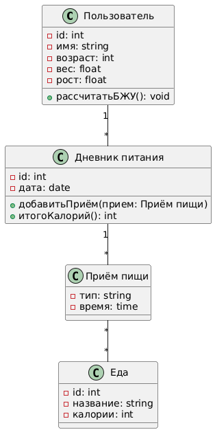

# Диаграмма классов

## Глоссарий
| Понятие                         | Описание                                                                                                                                                                                                                                    |
| ------------------------------- | ------------------------------------------------------------------------------------------------------------------------------------------------------------------------------------------------------------------------------------------- |
| **Пользователь (User)**         | Класс для хранения данных о человеке, ведущем учёт питания. Поля: `id`, `имя`, `возраст`, `вес`, `рост`. Методы: `рассчитатьБЖУ()`. Связь: один пользователь имеет множество записей **Дневник питания**.                                   |
| **Дневник питания (FoodDiary)** | Класс для дневника питания за определённую дату. Поля: `id`, `дата`. Методы: `добавитьПриём()`, `итогоКалорий()`. Связи: принадлежит одному **Пользователю**, содержит несколько **Приёмов пищи**.                                          |
| **Приём пищи (Meal)**           | Класс для описания отдельного приёма пищи (завтрак, обед, ужин и т.д.). Поля: `тип`, `время`. Методы (неявно): `добавитьЕду()`, `подсчитатьКалории()`. Связи: принадлежит одному **Дневнику питания**, содержит множество объектов **Еда**. |
| **Еда (Food)**                  | Класс, описывающий продукт или блюдо. Поля: `id`, `название`, `калории`. Связи: может входить в несколько **Приёмов пищи**.                                                                                                                 |
